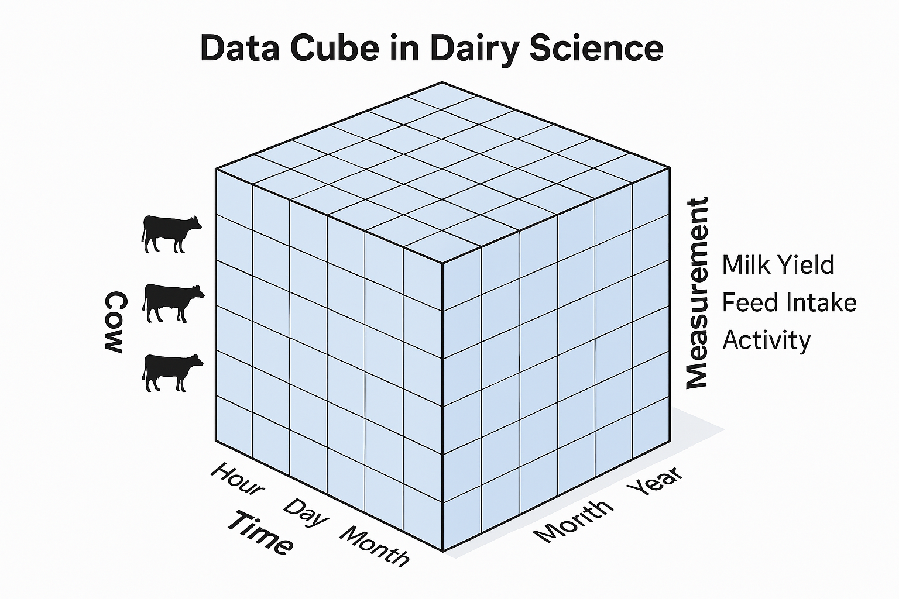

## Learning objectives

By the end, students can:

-   Name **common dairy data dimensions** (time, hierarchy, cohort) and why they explode
-   Identify the **unit of analysis** and the **level at which each variable exists**
-   Diagnose **duplicate rows, double counting, leakage**, and **inconsistent aggregations**
-   Implement safe patterns for **joins** and **aggregations**

## Why this lecture?

-   Dairy data is **high‑frequency**, **hierarchical**, **longitudinal**
-   Most failures are not “modelling failures”
-   They are **data alignment** and **aggregation** failures

> Data science does not fail on farms — **data alignment does**

## What do we mean by “dimensionality”?

A *dimension* is an axis along which data varies.

Examples:

-   Time
-   Cow
-   Herd
-   Lactation

## What do we mean by “dimensionality”?

-   Sensor
-   Pen / ration
-   Geography
-   Unit system (metric vs imperial)

More dimensions ≠ more insight.\
More dimensions = more ways to be wrong.

## The dairy “data cube”

Think of a cube as a multi-model (multi-D cube):

-   **Rows:** events/observations

-   **Columns:** features/metrics

-   **Indices:** time, animal, location, cohort, etc.

    {width="382"}

## The dairy “data cube”

As we add indices, we create:

-   Sparsity
-   Collinearity between data
-   Data leakage risk
-   Joining/aggregation complexity

## Dairy time is not one dimension

Time representations commonly used:

-   Exact timestamp (2026‑03‑24 05:12)
-   Hour (0–23) - Part of day (AM/PM)
-   Day -\> Week -\> Month -\> Quarter -\> Year

**Each choice changes the question you’re answering.**

## Example: milk yield

same cow, many “truths”

-   42.1 lbs at 05:12 (single milking)
-   84.3 lbs/day
-   589 lbs/week
-   22,300 lbs/lactation
-   27,100 lbs/year

All can be correct — but they are not interchangeable.

## Hierarchical levels in dairy data

Common levels:

-   Observation (sensor tick)
-   Milking
-   Day
-   Cow/Lactation
-   Farm/Herd/Pen

**Critical concept:** you must know the level at which each variable exists.

## The first rule

> **Always ask:** “At what level does this variable truly exist?”

Examples:

-   DIM exists at **cow‑lactation‑day** (or cow‑lactation‑timestamp)
-   Herd ration exists at **pen/day**
-   Somatic cell count exists at **sample event**

## Where curse of dimensionality shows up first

Before any modelling, we see:

-   Too many grouping choices, join keys, time anchors
-   Too many partially‑missing records

And the most common symptom:

> “My numbers don’t match the farm report.”

# Cross-sectional vs cohort aggregation

## Two types of time analyses

**Cross‑sectional (calendar anchored)**

-   “In 2025, what was the herd average milk?”

**Cohort / longitudinal (biology anchored)**

-   “For cows calving in 2025, what was milk at DIM 30?”

Mixing these without care causes inconsistent summaries.

## Cross‑sectional aggregation

Simple question:

> “What was the average milk yield per cow in 2025?”

Hidden decisions:

-   Per cow‑day vs per milking vs per cow‑year?
-   How do we treat a null values?
-   How do we treat a 0 value?

## Wrong approach (very common)

``` pseudo
GROUP BY cow_id, year
SUM(milk_kg)
```

Problem:

-   A cow that calved in 2024 produces milk in 2025
-   Does she belong to 2024 or 2025?
-   Can you use 2025 milk to evaluate things that happened in 2024

**Answer:** depends on *your definition*. The code above silently picks something.

## Calendar vs biology misalign

-   Year belongs to the **calendar**
-   Lactation belongs to **biology**

A single record can be:

-   Lactation started in 2025
-   Milk produced in 2026

If you do “year summaries” and “lactation summaries”, you must expect them to differ.

## Cohort analysis aggregation: calving year

Define cohort:

-   **Calving year = year(calving_date)**

Now analyze milk trajectories:

-   Milk by DIM
-   Health risk by DIM
-   Repro events by DIM

This aligns biology — but complicates reporting.

## The cohort trap (important!)

A cow can be included in a cohort summary because she calved *last year*, while her observations (milk yield, activity) occur *this year*.

This creates inconsistencies when:

-   dashboards are calendar‑based
-   biology summaries are cohort‑based
-   features are engineered without tracking the analysis level

# Best practices

## Key vocabulary

-   **Unit of analysis:** the row you want to model/report on
-   **Grain / level:** what one row represents
-   **Aggregation:** collapsing many rows into fewer
-   **Join:** combining tables; can multiply rows

If you don’t specify grain, the computer will pick a grain for you.

## Example dataset grains (typical)

-   `milk_milking`: one row per cow per milking
-   `activity_5min`: one row per cow per 5 minutes
-   `health_events`: one row per event
-   `calving`: one row per lactation
-   `ration_pen_day`: one row per pen per day

Joining these without planning is the fastest way to create incorrect numbers.

## The join problem (why duplication happens)

If you join:

-   600 rows in the table milk yield
-   with a table calvings that has 2 calvings for that cow
-   join by cow

You get how many rows?

## Always join at the highest common resolution

Golden rule:

> **Join on the highest common resolution (grain)**

## Potential solution

``` pseudo
-- Step 1: create lactation windows
lactation =
  SELECT cow_id, lactation_id,
         calving_ts, next_calving_ts
  FROM calving_table

-- Step 2: label each milk record to exactly one lactation
milk_labeled =
  SELECT m.*, l.lactation_id
  FROM milk_milking m
  JOIN lactation l
    ON m.cow_id = l.cow_id
   AND m.ts >= l.calving_ts
   AND m.ts <  l.next_calving_ts
```

Now you can aggregate safely by lactation.

## Group_by is not innocent

``` pseudo
GROUP BY herd_id
MEAN(milk_kg)
```

Implicit assumptions:

-   Each cow contributes equally
-   Each day contributes equally

Often false.

We must decide weighting:

-   Per cow‑day
-   Per cow

## Weighting example

If Cow A has 300 milking records and Cow B has 30:

-   **Milking‑level mean** overweights Cow A
-   **Cow‑level mean** treats both cows equally

You must choose *which* average you mean.

## Curse of dimensionality

If you have:

-   365 days
-   2 milkings/day
-   300 cows
-   3 lactations

Then rows/year ≈ 365 × 2 × 300 × 3 = **657,000**

Before sensors.

Now add:

-   288 five‑minute bins/day → 100× more

## Sparsity: why more features can hurt

As dimensions grow:

-   Many combinations never occur
-   Missingness increases
-   Models learn noise

## Aggregation choices (common pitfalls)

### Pitfall 1 — Aggregate after join

-   You join a high‑frequency table to an event table
-   Then you sum
-   You double count events or inflate totals

### Fix

-   Aggregate each table to your analysis grain **first**
-   Then join

## Practical rule of thumb

> **Aggregate first, then join.**\
> Never the other way around.

(There are exceptions, but they must be intentional.)

## Documentation: store grain + definitions

Every dataset should have:

-   Grain (one row per …)
-   Time anchor (calendar vs DIM)
-   Inclusion criteria (dry cows? first 7 DIM excluded?)
-   Unit conventions (kg, lb, ECM)

If it’s not written down, it’s not reproducible.

## Common join “smells” (warning signs)

If any of these happen, stop and inspect:

-   Row count increases unexpectedly
-   Summed milk increases after joining
-   Event counts change after joining
-   Same cow_id appears many more times than expected

## Debug technique: row‑count audit

Pseudocode:

``` pseudo
n_before = COUNT_ROWS(milk)
joined = milk JOIN calving USING (cow_id)
n_after  = COUNT_ROWS(joined)

IF n_after >> n_before:
  you created duplication
```

Also compute duplicates by key:

``` pseudo
COUNT(*) GROUP BY cow_id, ts HAVING COUNT(*) > 1
```

## Debug technique: sum invariants

If you join metadata, certain totals must remain invariant.

Example:

-   Total milk (kg) should not change when adding cow breed

``` pseudo
SUM(milk_kg) before join == SUM(milk_kg) after join
```

If it changes: duplication happened.

## Group_by pitfalls

``` pseudo
GROUP BY herd, year, month, week, day
```

Creates tiny groups → noisy means → missingness.

Pick ONE time scale aligned with the question.

## Practical checklist

Before any analysis:

1.  What is my **unit of analysis**?
2.  What is the **grain** of each table?
3.  What clock am I using? (calendar vs DIM)
4.  What cohort definition applies? (birth, calving, etc.)
5.  Aggregate at the target grain **before** joining
6.  Validate with invariants: row counts, sums, event counts
7.  Document units (kg/lb) and conversions

## Take‑home messages

-   Dairy datasets live on multiple clocks: **calendar** and **biology**
-   Hierarchies (cow → lactation → herd) must be explicit
-   Joins can multiply data silently
-   Aggregations must match the **question and grain**
-   The curse of dimensionality is often a **data engineering** problem

## Final message

> The cure is not “more modeling”\
> The cure is **explicit levels, explicit time anchors, and safe joins**
>
> And **naming conventions**!
