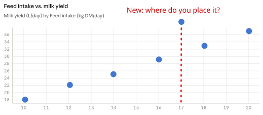
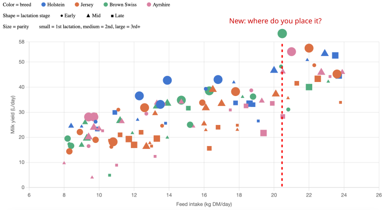
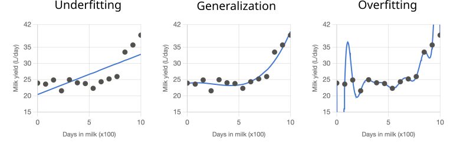

## Learning goals

- Understand what AI and ML actually are and how they work
- Be familiar with the different ML tasks
- Understand how to build a good ML model

## What's the difference?

{fig-alt="AI ⊃ ML ⊃ DL" fig-align="center" width="164"}

::: {.notes}
AI = machines doing "smart" things. ML = automating that with data. DL = models that imitate human brain.
AI without data is, for example, a chess bot made with hand-coded heuristics.
:::

## AI in daily life

| | |
|-------------------------------------|----------------|
| ChatGPT, Claude                     | |
| Face ID                              | |
| Recommendations (TikTok, Dating apps)  | |
| Google Maps (find optimal directions) | |
| Weather forecasts                   | |

## AI in daily life

| | |
|-------------------------------------|----------------|
| ChatGPT, Claude                     | DL             |
| Face ID                              | DL             |
| Recommendations (TikTok, Dating apps)  | DL             |
| Google Maps (find optimal directions) | AI           |
| Weather forecasts                   | ML             |

Deep Learning is increasingly dominating

## ML in dairy life

- Mastitis detection
- Cow identification
- Behavior detection
- Lameness scoring
- Predicting milk yield
- Heat stress alerts

## How it works: Exercise 1

{fig-alt="Where on the dotted line?" fig-align="center" width="164"}

::: {.notes}
It's easy to find the pattern.
:::

## How it works: Exercise 2

{fig-alt="Where on the dotted line?" fig-align="center" width="164"}

::: {.notes}
This is hard for humans, but easy for machines.
:::

## How it works: finding patterns

- Humans **find patterns**
- AI does the same, but faster and on large scale
- Same core principle, from ChatGPT to milk yield prediction

## Terminology

- **Features**: the inputs (breed, feed intake, …)
- **Labels**: what we want to predict (milk yield)
- **Model**: the *algorithm* that finds & learns the patterns

::: {.notes}
This is the vocabulary bridge. Everything after this slide uses these three words.
:::

## Types of learning tasks

- Regression — predict a number
- Classification — predict a class

- Supervised learning — learn with label
- Unsupervised learning — learn without

## Types of learning tasks - Examples

- Regression — lameness score, milk yield, ...
- Classification — mastitis diagnosis, pregnancy status, ...

- Supervised — all of the above, behavior identification
- Unsupervised — behavior identification

Some tasks can be modelled in different ways!

::: {.notes}
Give examples!
- lameness score, milk yield
- mastitis yes/no, cow identity
:::

## 3 ingredients of ML: Data

- Garbage in, garbage out
- Preprocessing: cleaning data
- Feature engineering: creating more useful features from existing data

## 3 ingredients of ML: Model

- Goal: Model works well on new data

{fig-alt="Overfitting, underfitting, generalization" fig-align="center" width="164"}

::: {.notes}
Link the cause back to pattern finding.
:::

## 3 ingredients of ML: Model

**Underfitting**: not complex enough

- cannot find the right patterns

**Overfitting**: too complex

- remembers the data
- sensitive to outliers

## 3 ingredients of ML: Objective

Each model optimizes an objective function / metric, e.g.

- Regression: MSE, MAE
- Classification: F1, AUC-ROC, accuracy

Many more, all with different pros & cons

Choose wrong objective → undesired behavior

## How to assess model quality?

Goal: Accurately estimate performance on new data

Cross-validation:

{fig-alt="Cross-validation" fig-align="center" width="164"}

## How to assess model quality?

Common pitfall: **Data leakage**

Model got information during training that would not be there when making real predictions

- Accidentally include the labels inside the training data
- Preprocessing before splitting
- When using time-series data: training on data in the future of the test data

## How to assess model quality?

Common pitfall: **Class imbalance**

Mastitis is rare (~5–10% of records)

Always predict "No" → 90–95% accurate

How to handle it:

- choose the right metrics
- choose and tune the right model
- data balancing

## How to assess model quality?

- Train metrics: 👎 → underfitting
  - Or bad or insufficient data
- Train metrics: 👍 BUT validation/test: 👎 → overfitting
- Test: 100% perfect → data leakage

## Key takeaways

- AI/ML is everywhere
- ML cleverly and automatically finds patterns in data
- For ML you need the right data, model and metrics
- It requires great care to properly train and validate a model